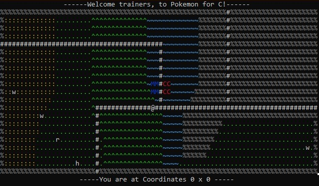
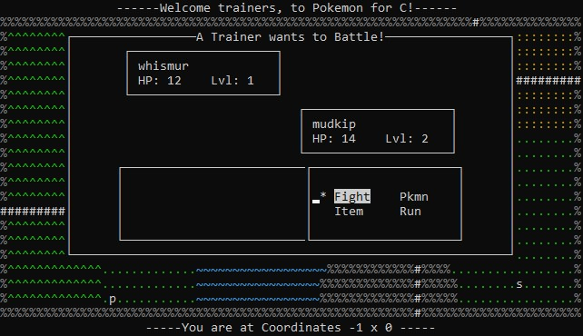

<!-- ABOUT THE PROJECT -->
## About The Project

Welcome to the world of Pokemon! Players can explore the world fighting trainers, catching and leveling up Pokemon. Shop at the PokeMart for potions and PokeBalls, and explore an increasingly difficult world as you play. Features include a plethora of sound effects and music using SDL2-mixer, and ASCII graphics implementation using the NCURSES library.

<!-- GETTING STARTED -->
## Getting Started


### Prerequisites

For use in Linux terminal with SDL2 installed for sound, and ncurses installed for terminal graphics.

### Installation

1. Clone the repo
   ```sh
   
   git clone https://github.com/lmunn64/PokeC.git
   ```
2. Install apt packages
   ```sh
   sudo apt-get install libsdl2-dev
   ```
    ```sh
   sudo apt-get install libncurses5-dev libncursesw5-dev
   ```


<!-- USAGE EXAMPLES -->
## Screenshots
<p align = "center"></p>
<p align = "center"></p>
<p align= "center">*USE WASD TO CONTROL BATTLE AND BAG MENUS*</p>


<p align="center">(<a href="#readme-top">back to top</a>)</p>


